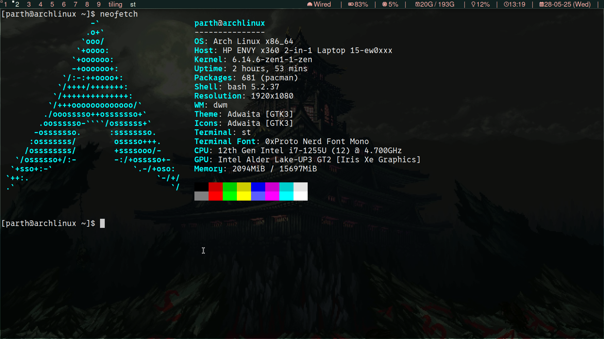

## Linux
- .bashrc
- .xinitrc
- wallpaper
- fonts
- aur list
- pkg list
---
## Terminal (st)
- config
---
## Window manager (DWM)
- config
### DWM bar
- config
- modules
- script
---
## Editor (nvim)
- config
---
## Setup

