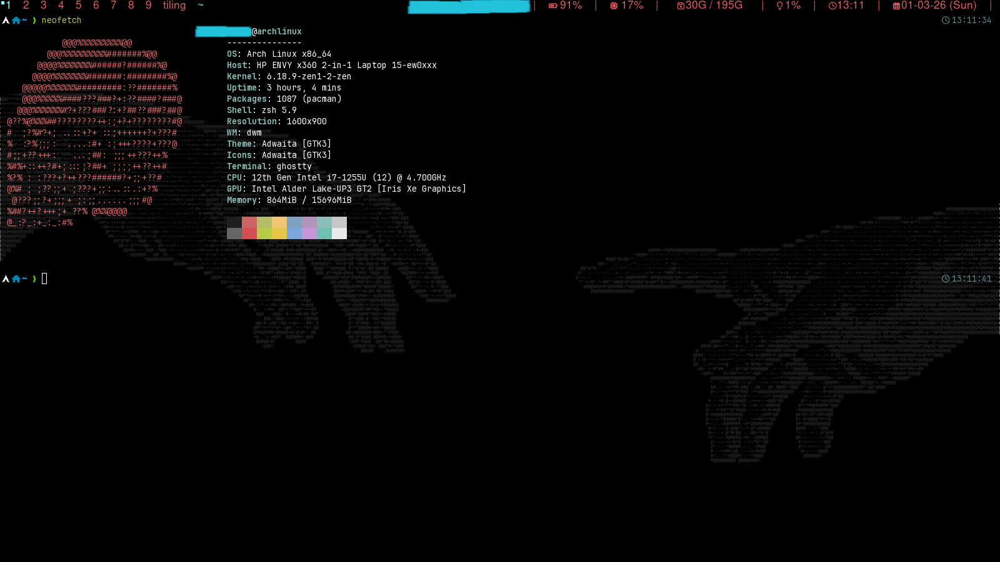

## Linux
- .bashrc (old)
- .xinitrc (old)
- .zshrc
- .xinitrc
- wallpaper
- fonts
---
## Terminal (ghostty)
- config
---
## Window manager (DWM)
- config
### DWM bar
- config
- modules
- script
---
## Editor (nvim)
- config
---
## Setup

